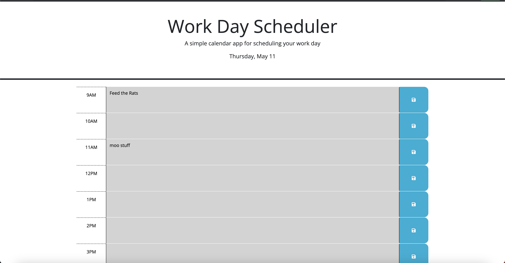

# work-day-planner-app

## Description

In this challenge for the UofTor coding bootcamp, we had to adjust starter code to make a functioning work day scheduler.  It was designed to test our understanding of jQuery, a bit of Bootstrap, and Day.js.  Specifically I found it really forced me to take what I had learned in JavaScript and properly adapt to jQuery's "slang".  It was also good practise in targeting specific classes and IDs.  

## Usage

The dayplanner works by the user inputting their plans into the designated time block.  After the user clicks the save button, the value that they entered into the time block is saved in local storage.  When the page is reloaded, the value is retrieved from local storage and displayed in the time block, so the user does not need to retype the information everytime they load the page.  Additionally, if the time, time blocks that occur in the past are given a grey background,, red for the current time block, and green for future time blocks.  Also the current day is displayed in the header.

Link to live site: https://sunderfire.github.io/work-day-planner-app/
    

    
## Credits

Critical documentation to my success included

Day.js documentation: https://day.js.org/docs/en/display/format

jQuery api documentation: https://api.jquery.com/

## License

Please refer to LICENSE

